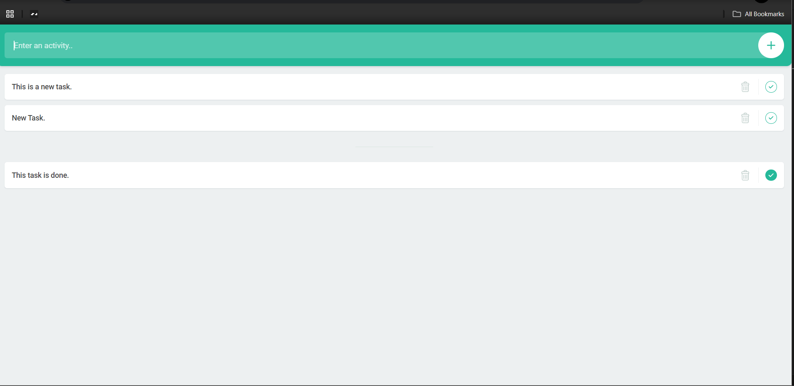

# To-Do List Web Application

This is a simple and user-friendly **To-Do List** web application built using **HTML**, **CSS**, and **JavaScript**. The app allows users to add tasks, mark tasks as complete, and delete tasks. It provides an intuitive interface for personal task management.

## Features

- **Add New Tasks:** Users can easily add new tasks by typing in the input field and clicking the "+" button.
- **Mark Tasks as Completed:** You can mark tasks as done by clicking the checkbox next to the task. Completed tasks will be visually distinguished.
- **Delete Tasks:** Remove tasks from the list by clicking the trash icon.
- **Responsive Design:** The app is designed to work smoothly on both desktop and mobile devices.

## Screenshot



> **Note:** Replace `path-to-your-image.png` with the correct relative path where you have placed your screenshot in the repository.

## Technologies Used

- **HTML5** for structuring the app.
- **CSS3** for styling and layout.
- **JavaScript (ES6)** for the functionality of adding, deleting, and marking tasks as completed.

## Installation and Setup

Follow these steps to set up and run the project locally on your machine.

### Prerequisites

Ensure you have the following installed on your local development environment:

- A modern web browser (Google Chrome, Mozilla Firefox, etc.).
- A text editor like **VS Code** for code modifications (optional).
- **Git** (if you want to clone the repository directly from GitHub).

### Step-by-Step Installation

1. **Clone the repository:**

   Open your terminal/command prompt, navigate to the folder where you want to clone the project, and run the following command:

   ```bash
   git clone https://github.com/your-username/todo-app.git
   ```

## License

[MIT](LICENSE.md)
